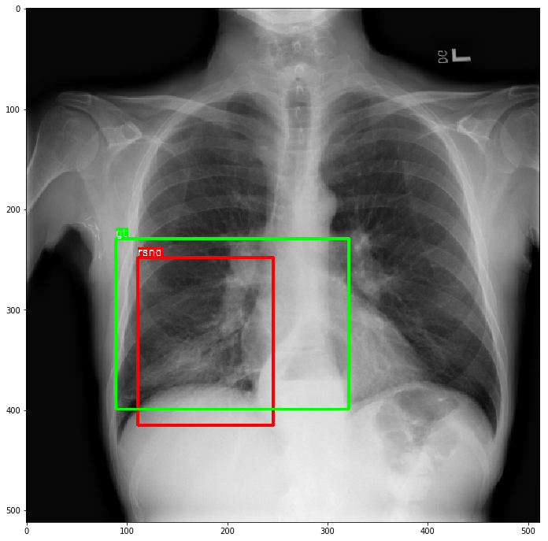

## An Implentation of RetinaNet in Pytorch

#### optional backbone:
- [se_resnext50_32x4d](http://data.lip6.fr/cadene/pretrainedmodels/se_resnext50_32x4d-a260b3a4.pth)
- [se_resnext101_32x4d](http://data.lip6.fr/cadene/pretrainedmodels/se_resnext101_32x4d-3b2fe3d8.pth)

#### usage:
`setup.sh`: compile cython code 
`config.json`: config file 
`train.py`: main train script 
`dataGen/data_loader.py`:  Subclass **torch.utils.data.Dataset** or modify **class RsnaDataset** for your owen dataset. 
`prepare_data.ipynb`: data processing script for **RSNA Pneumonia Detection Challenge** 
`demo.ipynb`: sample code showing how to predict with **model.predict** method

---
#### Application
train this model with dataset of [RSNA Pneumonia Detection Challenge](https://www.kaggle.com/c/rsna-pneumonia-detection-challenge)

### credits:
1. [Cadene pretrained-models.pytorch](https://github.com/Cadene/pretrained-models.pytorch)
2. [fizyr/keras-retinanet](https://github.com/fizyr/keras-retinanet)
3. [Squeeze-and-Excitation Networks](https://arxiv.org/pdf/1709.01507.pdf)
4. [Focal Loss for Dense Object Detection](https://arxiv.org/pdf/1708.02002.pdf)